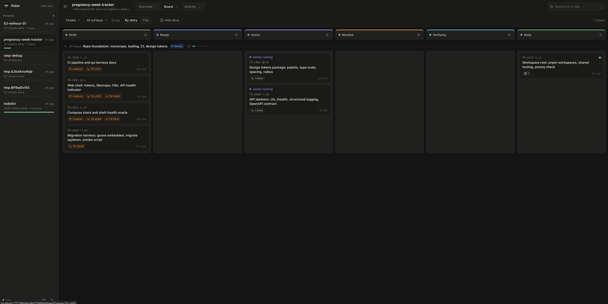
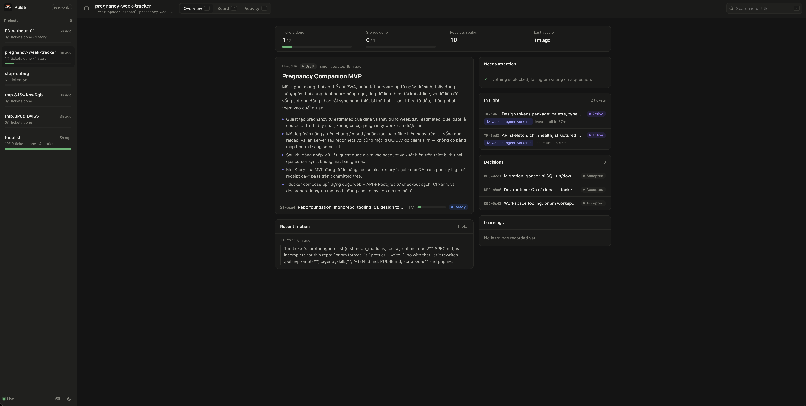
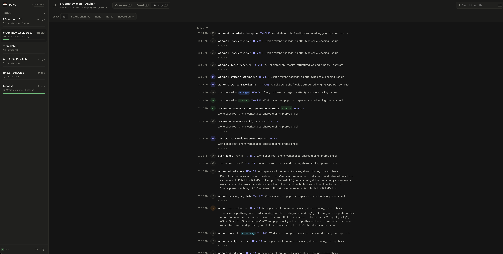
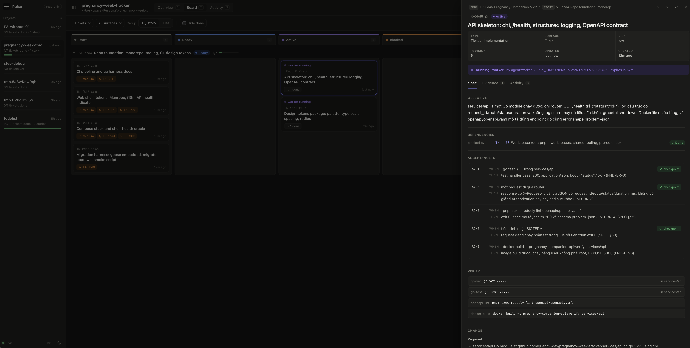
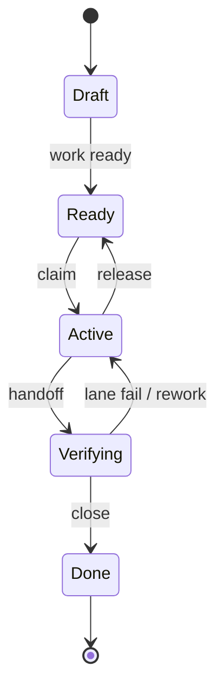

<div align="center">


# Pulse

<p><strong>A repository harness for coding agents — work becomes evidence the repository can prove</strong></p>

<p>
  
  
  
</p>

</div>

Pulse turns a repository into the operating surface for coding-agent work:
one local binary brackets every unit of work with gates and evidence —
plan, claim, handoff, review, close — so that "done" is a state the
repository can prove, not a sentence an agent wrote. The work graph,
receipts, run observations and the event log are plain files under Git
(`.pulse/` and `docs/`); the repository remains the system of record.

## Read-only board

<table>
  <tr>
    <td width="50%"></td>
    <td width="50%"></td>
  </tr>
  <tr>
    <td width="50%"></td>
    <td width="50%"></td>
  </tr>
</table>

## Why

Coding agents usually fail for ordinary engineering reasons, and none of
them are fixed by more prompting:

- **Intent lives in chat, not the repo.** Pulse keeps Epic / Story /
  Ticket / Decision records in one human-editable JSONL store — the next
  session continues from files, not from memory.
- **"Done" is self-reported.** Handoff reads receipts Pulse observed
  itself: `pulse verify` runs exactly the argv a ticket declares and
  records exit codes and logs; nothing an agent merely claims counts.
- **Agents collide on files.** Tickets declare the files they
  `touch` (`touches`);
  disjoint tickets claim side by side in one checkout, a host pre-edit
  hook binds reservations at edit time, and the handoff gate rejects
  edits made outside every reservation.
- **Review is vibes.** Review and qa lanes run as blind seats with
  bounded inputs, panels reconcile findings under a quorum, and a
  finding's `check.argv` is executed by Pulse — an observed check beats
  any number of votes.
- **Lessons evaporate.** Friction noted at the gate becomes a learning;
  once a human activates it, its mechanical check runs inside
  `pulse verify` on every matching ticket — the same mistake gets
  harder to repeat.
- **History cannot be reconstructed.** An append-only event log, sealed
  receipts with source fences (commit + dirty hash), and evidence
  artifacts make any piece of work auditable after the fact.

## How it works

A Ticket moves through gates, and every gate produces evidence:



1. **Shape & plan** — `pulse work new` drafts the graph; `pulse work
   ready` runs the ready gate (acceptance, anchors, qa cases,
   classification, `touches`).
2. **Claim** — `pulse claim` takes the lease and the file reservation;
   `pulse frontier` answers "what can run right now" for the host.
3. **Work** — `pulse packet` is the one bounded JSON a worker reads;
   `pulse verify` runs the declared commands; `pulse checkpoint`
   records progress.
4. **Hand off** — the handoff gate checks acceptance, observed verify
   receipts, docs diffed, and that no file changed outside a
   reservation, then seals the receipt and drops the lease.
5. **Review** — `pulse lane input` writes each blind seat's bounded
   input; `pulse lane seal` validates the output against the pre-run
   source snapshot; panels reconcile through `pulse lane reconcile`.
6. **Close** — `pulse close` requires every profile lane to have passed
   on the handoff's fence, sealed by someone other than the worker.

The fence is the quiet core: Pulse pins workspace state as commit plus
dirty-hash, scoped to a ticket's `touches`, so one ticket's close
survives another ticket's commit landing first.

## What ships today

| Area | Commands | Notes |
|---|---|---|
| Repository init | `pulse init` / `--refresh` | Seeds `.pulse/`, `PULSE.md`, the `AGENTS.md` block, prompts, docs seeds; registers the repo for `pulse serve`; `--refresh` three-way merges template changes (files you edited are never overwritten) |
| Guidance skills | `pulse skills install` / `hosts` | Writes the `pulse-shape` / `pulse-plan` / `pulse-learn` skills into `.agents/skills/` and symlinks them into the hosts you choose (`claude`, `opencode`) |
| Work graph | `pulse work new\|show\|list\|tree\|ready\|update\|dep\|transition` | One JSONL store of Epic/Story/Ticket/Decision records, JSON-schema validated, append-only events |
| Parallel work | `pulse frontier`, `pulse claim`, `pulse reserve`, `pulse release`, `pulse hook pre-edit` | File reservations from claim to done; the pre-edit hook (config from `pulse hook snippet claude`) binds them at edit time — shell writes bypass it and the handoff gate is the second net |
| Evidence | `pulse packet`, `pulse checkpoint`, `pulse handoff`, `pulse verify`, `pulse close`, `pulse close-story`, `pulse close-epic` | Observed receipts, not self-reported exit codes; `verify` runs exactly the declared argv |
| Review lanes | `pulse lane input\|seal\|reconcile` | Blind seats, panels with quorum, finding reconciliation; a finding's `check.argv` is run by Pulse and beats votes |
| Learning loop | `pulse note --friction`, `pulse learn add\|show\|applicable\|friction\|dismiss\|activate\|retire`, `pulse metrics` | Friction surfaces at close-story; a human activates a learning, then its check runs inside `pulse verify` for matching tickets |
| Docs | `pulse docs applicable\|check` | Broken links, stale generated sections, advisory docs-maybe-stale per ticket; `docs check --ticket --write` **is** the whole `check-docs` lane, no agent needed |
| Health | `pulse doctor`, `pulse events tail` | Torn store, expired leases, unsealed lanes, suspects, stale cites; follow the event log |
| Board | `pulse serve` | Read-only board server over registered projects, bound to `127.0.0.1` — no write endpoints |

Every command accepts the global `--repo-root <path>`; most also accept
`--actor` and `--json`. Errors print `{code, message, hint?}` and exit 1.

## What Pulse is not

- **Not an orchestrator.** Pulse dispatches nothing — the host spawns
  the agents; Pulse decides what counts.
- **Not a daemon.** One command, one process; nothing runs in the
  background.
- **Not an agent runtime.** The only processes it ever spawns are argv a
  record declares: a ticket's `verify[]`, an active learning's check, a
  finding's `check.argv`, a generated doc's check.
- **Not a service.** The one network surface is `pulse serve`, a
  read-only board bound to `127.0.0.1`.
- **Not a database or SaaS.** All state is plain files under Git; hand
  edits to the store are legal and supported.

Known limits are stated plainly in
[`SPEC.md` §13](SPEC.md#13-known-limits-honest) — identity is
self-declared, shell writes bypass the hook, and a few sharp edges are
documented rather than hidden.

## Quick start

From the target repository, install the CLI, enroll the repo and link the
skills for every detected coding-agent host in one step:

```bash
curl -fsSL "https://raw.githubusercontent.com/quanpersie2001/pulse/main/scripts/install-pulse.sh?$(date +%s)" |
  bash -s -- --yes
```

The bootstrap requires Rust 1.78+ and git. It installs from `main` by
default; use `--ref <tag>` to pin a release, `--host claude` to choose a
host, or `--with-qa-templates` to add the shipped QA runners. It never edits
host settings.

From a local Pulse checkout instead:

```bash
scripts/install-pulse.sh --source . --directory <target-repo> --yes
```

For Claude Code, paste the configuration printed by:

```bash
pulse hook snippet claude
```

Then give the outcome to a **host agent** — the human does not create or
run Tickets by hand:

```text
Use Pulse to deliver <outcome>. Act as the host: read AGENTS.md, PULSE.md
and .pulse/prompts/host.md; classify the work, invoke pulse-shape and
pulse-plan when needed, create/ready records after my approval, and spawn
separate worker and review/QA agents through close. Ask me only for product
decisions or a required human gate.
```

The host agent drives Pulse; Pulse records what counts. `pulse serve --open`
opens a read-only board over everything you enrolled.

The full operator workflow — prompting the host, shaping/planning,
parallel workers, independent lanes, panels, rework and learning — is
[`docs/USAGE.md`](docs/USAGE.md).

## Development

```bash
cargo fmt --check
cargo clippy --all-targets --quiet -- -D warnings
cargo test --all-targets
```

The suite must pass at default thread count. Prompt and skill text is
measured by the mechanical evals in [`evals/`](evals/) (plan 0026) —
`node evals/run.mjs E3 without 1` is the cheapest shakedown.

| Document | What it holds |
|---|---|
| [`docs/USAGE.md`](docs/USAGE.md) | Install and operate Pulse through host, worker and review agents |
| [`SPEC.md`](SPEC.md) | The full specification — what runs today |
| [`ARCHITECTURE.md`](ARCHITECTURE.md) | How the code tree is shaped |
| [`AGENTS.md`](AGENTS.md) | The operating contract for agents and contributors |
| [`CONTRIBUTING.md`](CONTRIBUTING.md) | Contribution workflow |
| [`docs/plans/`](docs/plans/) | The reasoning behind what shipped |
| [`docs/decisions/`](docs/decisions/) | Decision records |
| [`PRODUCT.md`](PRODUCT.md) | v2 history |

<div align="center">

MIT License

</div>
