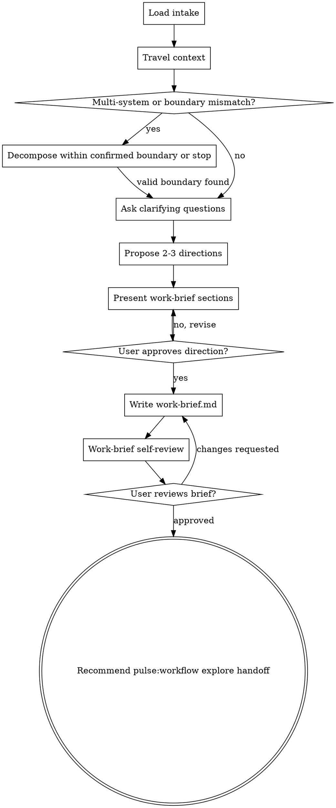

# `pulse:workflow brainstorm`

Turns admitted but under-shaped work into an approved story/work-level `work-brief.md` through structured dialogue before downstream discovery or implementation planning begins.

This command shapes exactly one confirmed work boundary at a time. It does not brainstorm an epic-wide execution tree, and it does not write its output into the story `README.md`, `SPEC.md`, or `DESIGN.md`.

Approved work briefs reduce downstream rework by stopping direction and assumption drift before it compounds.

This command should behave like a disciplined direction-setting session:
- walk the direction tree until no planning-critical intent branch is unresolved
- ask the user only what the repo and docs cannot already answer
- when a strong default exists, include a recommended answer so the user can confirm or override it quickly

<HARD-GATE>
Do NOT invoke another workflow command, write any code, create work items, or take implementation action until a `work-brief.md` has been presented AND the user has approved it.
This applies regardless of perceived simplicity. The brief can be short, but it MUST exist and be approved.
</HARD-GATE>


## Technical boundary

Brainstorm may discuss **technical direction**. It must not produce **technical design**.

Allowed examples:
- “Prefer direct handlers over MediatR-style mediator abstraction to keep flow debuggable.”
- “Keep runtime mutation separate from conversational workflow routing.”
- “Prioritize tenant isolation over premature partitioning.”
- “Use an incremental migration direction rather than a big-bang rewrite.”

Not allowed:
- concrete interfaces, classes, functions, or APIs
- file/module ownership
- concrete data schema, table fields, indexes, ERD, migration, or backfill plan
- final multi-tenant partitioning design
- detailed test plan or validation command list
- implementation sequence or work breakdown
- repo-grounded decisions that require code/schema/test evidence

If a technical choice depends on repo evidence, record it as an assumption or follow-up question, not as a final design. If the user explicitly mandates a technical constraint, record it as a user-approved constraint and mark any repo impact as unresolved.

## Anti-pattern: "This is too simple to need a brief"

Every new feature or technical change with unclear direction goes through this process when brainstorm is selected. A new config capability, a new function that expands behavior, a new workflow behavior, a harness refactor, a pattern choice — if the shape is still fuzzy, this is where you turn it into an approved work brief. "Simple" work is where unexamined assumptions cause the most wasted downstream work. The brief can be a paragraph. But you MUST present it and get approval.

This is not the path for trivial non-feature corrections already covered by lighter execution posture. If the request is only a wording fix, local correction, or similarly bounded non-feature adjustment, follow the lighter route instead of forcing a brainstorming brief.

---

## Quick reference

| Step | What you do | What you produce |
|---|---|---|
| Load intake | Read the owning story `intake.md` as the authoritative admission context | Intake-grounded brainstorming target |
| Travel context | Read relevant project material to understand what already exists | Internal context snapshot |
| Assess scope | Decide whether this is one work boundary or multiple independent systems | Scoped brainstorming target |
| Clarifying questions | Ask one question at a time to uncover purpose, constraints, and success criteria | Validated direction inputs |
| Approaches | Present 2–3 viable directions with trade-offs | Chosen direction |
| Brief sections | Present the work brief in sections and validate incrementally | Approved work direction |
| Brief | Write the approved direction to `works/epics/<epic-id>-<epic-slug>/<story-id>-<story-slug>/work-brief.md` using [work-brief.template.md](work-brief.template.md) | Stable brief for downstream workflow |
| Self-review | Run the work-brief reviewer and fix serious issues | Downstream-ready work brief |
| User review gate | Wait for explicit approval on the written brief | Approved handoff artifact |
| Handoff | Update runtime mirrors when recording posture and recommend `pulse:workflow explore` as the next manual step | Clean pipeline transition |

---

## Checklist

Create a task for each item and complete them in order:

1. **Load intake** — read the owning story `intake.md` before asking questions or shaping direction
2. **Travel context** — read files, docs, and recent commits relevant to avoiding already-answerable questions
3. **Assess scope** — is this one work boundary or multiple independent systems?
4. **Ask clarifying questions** — one at a time; purpose, constraints, and success criteria
5. **Propose 2–3 directions** — with trade-offs and your recommendation
6. **Present brief sections** — in sections scaled to complexity; get user approval after each section when needed
7. **Write work brief** — save the approved direction to `works/epics/<epic-id>-<epic-slug>/<story-id>-<story-slug>/work-brief.md` and note the path
8. **Work-brief self-review** — independent check for placeholders, contradictions, scope, implementation leakage, and ambiguity
9. **User reviews work brief** — ask the user to confirm before proceeding
10. **Handoff to `pulse:workflow explore`** — recommend `pulse:workflow explore` as the next manual step; do not invoke it by default

---

## Process flow



**The terminal state is an approved `work-brief.md` under `works/` plus runtime mirror updates when workflow posture is recorded, with `pulse:workflow explore` recommended as the next manual step.** Do NOT invoke planning, validating, or any execution command by default. Do not invoke `pulse:workflow explore` unless the user explicitly asks to continue.

---

## Phase 1: Load intake and travel context

Before asking any question, ground brainstorming in the confirmed intake result:

- Read the owning story `intake.md` first. Treat its input type, correlation outcome, boundary, lane, risk flags, affected surfaces, artifact obligations, and recommended next command as the admission context for this brainstorming session.
- If the owning story `intake.md` is missing or the target story boundary is unclear, stop and ask the operator to return to intake or identify the confirmed story boundary before continuing.
- Read existing story artifacts under `works/` next when present, then inspect the smallest relevant repo docs or code paths needed for the request.
- Reuse established glossary and terminology from story artifacts or code when present; do not invent new terms when established names already exist.
- Before asking, eliminate questions the repo can already answer. Read docs, code, and recent repo history first, then ask only for unresolved direction or intent.
- Check relevant files, docs, and the last few commits related to the topic.
- Identify existing patterns, components, or decisions that constrain the direction, but do not lock repo-grounded implementation design here.
- Note what appears reusable, risky, or uncertain as open assumptions for downstream workflow.

Build an internal picture first. It makes clarifying questions concrete instead of generic.

---

## Phase 2: Scope assessment

Before asking detailed questions, assess whether the request is one confirmed work boundary or several.

**One work boundary** — scoped work with a clear confirmed boundary. Continue normally.

**Multiple independent systems** — for example, "build a platform with auth, billing, and analytics."
Flag this immediately:

> "This covers [A], [B], and [C] — three independent systems. Each needs its own brainstorming session. Let's start with [most foundational]. I'll note the others for later."

Then brainstorm only the first subsystem that fits the confirmed boundary. Capture the rest as deferred ideas.

If no subsystem fits the confirmed boundary, stop and ask for a corrected boundary before continuing. Do not write `work-brief.md` under the wrong story.

### Step-back move — use selectively

Before detailed questioning, decide whether the request needs one brief step-back pass. This is not a new phase and not a replacement for sequential questioning. It is a short framing move to help ask better questions.

Use it only when one of these is true:
- the request names a solution but not the problem it should solve
- multiple work directions could satisfy the request
- the user is jumping quickly into screens, components, patterns, schema, or flows before the core outcome is clear
- you notice yourself optimizing implementation detail before the work outcome is concrete

If you use the move, do it once, briefly, before Phase 3:
1. name the core outcome in plain language
2. name 2–4 decision axes that matter most
3. identify what should not be optimized yet
4. turn that framing into the next single question

Keep the output internal unless a short external framing statement will help the user align. Do not turn the step-back move into a mini-plan, a multi-question bundle, or an excuse to skip the structured question flow.

Example internal frame:
- Outcome: "Help a first-time user complete X confidently."
- Decision axes: primary user, success event, scope boundary, failure tolerance
- Not yet: exact layout, concrete schema, module ownership, implementation mechanics

---

## Phase 3: Clarifying questions

<HARD-GATE>
Ask ONE question at a time. Wait for the user's response before the next.
Do NOT batch questions. Do NOT answer your own questions.
If the active harness provides `AskUserQuestion`, `AskMeTool`, or another structured question tool, you MUST use it for every brainstorming question.
Do NOT ask a plain-text question while a structured question tool is available.
Only fall back to plain-text questions when no structured question tool exists in the current harness.
This gate is non-negotiable.
</HARD-GATE>

**Rules:**

- One question-tool invocation per turn — or one plain-text fallback question when no tool exists.
- Use structured question tools in this order when available: `AskUserQuestion` → `AskMeTool` → another equivalent harness-native question tool.
- Multiple-choice is preferred over open-ended when possible.
- Start broad — what, why, for whom — then narrow toward constraints, edge cases, and success criteria.
- For every question, include a clearly labeled recommended answer when a strong default exists.
- Keep walking the direction tree until each brief-critical branch is chosen, rejected, delegated, or explicitly deferred.
- Do not stop after collecting preferences if downstream workflow would still need to guess the approved direction.
- If the request is still shapeless after context review, use one brief step-back move before the next question so the question targets the real direction instead of a local detail.
- After 3–4 questions on one area, checkpoint with the structured question tool when available: "More questions about [area], or move on?"
- Do not mix plain-text questions and tool-based questions arbitrarily inside the same session.

**Question patterns:**

- **Outcome / constraints** → structured multiple-choice or short open-ended question via the harness question tool when available.
- **Competing directions / hierarchy / flows** → ask the decision through the harness question tool when available, using concise text choices instead of visual mode.
- **Technical pattern direction** → ask as a trade-off choice, not as implementation design.
- **Data/domain direction** → ask about ownership, isolation, and conceptual model; do not ask the user to approve concrete schema here.
- **Trade-off choice** → keep it in text and ask through the harness question tool when available.
- **Checkpointing** → after a few questions on one area, confirm whether to continue or advance with the harness question tool when available.

Examples:
- Text: "Which primary outcome should this optimize for first?"
- Layout choice: "Which dashboard structure is closer to the experience you want: navigation-first, metrics-first, or workflow-first?"

**Scope creep** — when the user suggests something out of scope:

> "[Feature X] is a new capability — that's its own work item. I'll note it as a deferred idea. Back to [current topic]: [return to question]"

---

## Phase 4: Propose directions

Present 2–3 different directions before committing to one:

- Describe each option concisely with its trade-offs.
- Lead with your recommended option and explain why.
- For technical work, distinguish direction/pattern/principle choices from implementation design.
- Capture assumptions that must be resolved later.
- Invite the user to push back or ask about specific trade-offs.

Do NOT write the brief until the user picks a direction.

---

## Phase 5: Present work-brief sections

Once the direction is clear, present the work brief sections:

- Scale each section to its complexity — a few sentences if simple, 200–300 words if nuanced.
- Ask "Does this look right so far?" after each section before moving to the next.
- Cover outcome, motivation, chosen direction, expected behavior, scope boundary, constraints, open assumptions, and verification intent.
- For technical work, include only directional technical notes: architectural intent, principles, pattern preference, conceptual responsibility split, and trade-offs.
- Be ready to revise. If something does not make sense, go back and clarify.

**Direction for isolation:**

- Name conceptual responsibilities when useful, but do not assign final module/file ownership.
- Identify which concerns should remain separate at the conceptual level.
- For new work, define ownership intent at the conceptual level so later workflow can refine concrete boundaries.
- A narrow first phase is acceptable only when the ownership model and final boundaries are already correct.
- Do not collapse multiple future concerns into one temporary implementation just to ship an MVP-shaped first version.
- If the direction requires a concrete repo boundary to be safe, record it as an open assumption instead of deciding it here.

**Working in existing codebases:**

- Respect existing patterns as context. Do not propose unrelated refactoring.
- Where existing code appears to constrain the work, capture targeted open assumptions or constraints.
- Stay focused on what serves the current goal.

---

## Phase 6: Write work brief

After the user approves the direction and brief content, write the work brief.

**Path:** target story `work-brief.md` under `works/`, typically `works/epics/<epic-id>-<epic-slug>/<story-id>-<story-slug>/work-brief.md`

**Template:** use [work-brief.template.md](work-brief.template.md) from this command directory.

Rules:
- Derive the target story path from the confirmed intake boundary and its owning `intake.md`.
- If the canonical story path is already known, write directly there.
- If the exact `works/` path is not yet known, confirm the target location with the user instead of inventing another artifact root.
- Do not overwrite the story `README.md`; that file remains the durable story description, not the brainstorming output.
- Do not write `SPEC.md` or `DESIGN.md` for brainstorm output.
- The brainstorm artifact is a sibling file named `work-brief.md` inside the story directory.

The work brief must include the direction-level information needed downstream:
- outcome and motivation
- approved direction summary
- expected behavior at story/work level
- optional directional technical notes when relevant
- user-approved constraints and open assumptions
- high-level verification intent
- explicit in-scope, out-of-scope, and deferred items

Do not write the work brief before the user approves the direction.

---

## Phase 7: Work-brief self-review

After writing the work brief, run an independent review using [work-brief-reviewer-prompt.md](work-brief-reviewer-prompt.md).

Self-review must check for:
- TODOs, placeholders, or incomplete sections
- internal contradictions or conflicting requirements
- ambiguity serious enough to cause the wrong thing to be built
- scope that is too broad for a single work boundary
- unrequested features or over-engineering
- implementation leakage: concrete schema, ERD, file/module design, interfaces, migration plan, detailed test plan, or execution sequence
- missing or unclear open assumptions

If serious issues are found:
- fix inline
- rerun the review
- stop after 2 repair loops and ask the user to review directly if serious issues remain

---

## Phase 8: User review gate

After the work-brief self-review passes:

> "Work brief written to `<works story work-brief.md path>`. Please review it and let me know if you want any changes before we continue."

Wait for the user's response. If they request changes, make them, rerun the self-review loop when needed, and only proceed once the user approves.

---

## Phase 9: Handoff

After user work-brief approval:

1. Update `.pulse/runtime/state.json` and `.pulse/runtime/STATE.md` together if recording workflow posture:
   ```
   Current: brainstorming complete for <work>
   Work brief: <works story work-brief.md path>
   Next: invoke pulse:workflow explore
   ```

2. Present a concise next-action recommendation: `pulse:workflow explore`.

3. Do not invoke `pulse:workflow explore` by default. Ambiguous acknowledgements like “ok” or “approved” approve the brief only; they do not authorize chaining into another command.

<HARD-GATE>
Do NOT create work items, write code, plan, validate, execute, or chain into another workflow command. The only recommended next manual command is `pulse:workflow explore`.
The terminal state of this command is a written, approved `work-brief.md` and synchronized runtime state when runtime posture is recorded.
</HARD-GATE>

---

## Key principles

- **One question at a time** — never overwhelm.
- **Multiple-choice preferred** — easier to answer than open-ended.
- **Question relentlessly, but only about decisions the repo cannot already answer.**
- **Use concise text diagrams or option labels only when they clarify** — seeing options should remove ambiguity, not add noise.
- **Honor existing glossary first** — prefer established project terminology and call out conflicts early.
- **YAGNI ruthlessly** — remove unrequested features from all directions.
- **Always propose alternatives** — 2–3 directions before settling.
- **Incremental validation** — present brief sections, get approval before writing the artifact.
- **Be ready to revise** — go back and clarify when something does not fit.
- **Technical direction is allowed; technical design is not.**
- **Do not scaffold repo-level docs here** — brainstorming consumes existing context and writes only the approved story `work-brief.md`.

---

## What this command does NOT do

These are not brainstorming responsibilities:

- deep codebase research beyond what is needed to understand the direction
- locking implementation decisions with stable IDs
- gray-area extraction against domain probes
- writing downstream context/planning artifacts
- creating concrete technical design
- defining concrete data schema, ERD, migrations, indexes, or partitioning strategy
- defining exact interfaces/classes/modules/files
- writing detailed test plans or validation command lists
- creating work items

Brainstorming delivers an approved `work-brief.md`. Later workflow consumes it as the approved direction artifact.

---

## Red flags

Stop immediately if you catch yourself doing any of these:

- writing code or pseudocode during brainstorm
- asking two questions in the same message
- asking a plain-text question while `AskUserQuestion`, `AskMeTool`, or another structured question tool is available
- skipping the work brief because the change "seems obvious"
- answering a question you just asked
- treating UI topics as requiring a separate visual mode instead of asking clear text questions
- invoking or chaining into another workflow command
- creating concrete technical design
- defining concrete data schema, ERD, migrations, indexes, or partitioning strategy
- defining exact interfaces/classes/modules/files
- writing detailed test plans or validation command lists
- creating work items or referencing non-workgraph item IDs
- writing brainstorm output to `SPEC.md`, `DESIGN.md`, or story `README.md`

---

## Anti-patterns

**"The user wants to move fast"**
Speed comes from clarity. A 10-minute direction session prevents hours of downstream rework caused by wrong assumptions.

**"I already know what to build"**
Your assumptions are hypotheses until the user validates them.
Run the clarifying flow and let the user confirm the direction.

**"This is too small to document"**
The brief can be three sentences. But it MUST exist so downstream workflow has a stable direction artifact.

**"This is technical, so brainstorm cannot discuss it"**
No. Brainstorm may discuss technical direction, pattern preference, principles, and trade-offs. It must not produce concrete technical design or implementation shape.

**"We selected a pattern, so the design is done"**
No. Pattern selection in brainstorm is directional unless backed by later evidence and implementation shaping.

**"This needs an ERD now"**
Usually no. Brainstorm may capture data ownership and isolation intent. Concrete schema, ERD, migration, and partitioning strategy are not brainstorm output.
