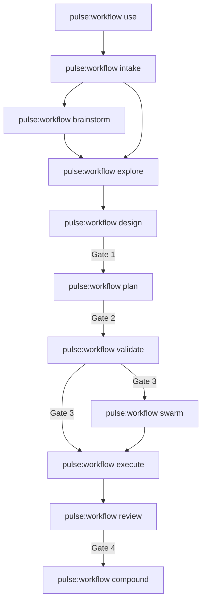

# Pulse Architecture

This document explains Pulse v2 as a single public router skill with a separate runtime CLI.

## In One Sentence

Pulse is a repo-local workflow system where `pulse:workflow` defines user-facing flow, `{{pulse_command}}` reads and coordinates runtime state, and approval gates prevent unsafe execution.

## Mental Model

Pulse has four cooperating layers:

1. **Router contract**: `skills/workflow/SKILL.md` and `skills/workflow/references/*`.
2. **Runtime control plane**: `.pulse/runtime/` for state, handoffs, and reservations.
3. **Workgraph plane**: `.pulse/workgraph/items.jsonl` plus derived views.
4. **Work content plane**: `works/` artifacts and verification evidence.

## Delivery Chain

## Responsibilities

| Command | Responsibility |
| --- | --- |
| `pulse:workflow use` | Normal session entry; bootstraps readiness when needed and restores context |
| `pulse:workflow intake` | Classify new work and establish the owning epic/story boundary when needed |
| `pulse:workflow brainstorm` | Shape and approve work direction before discovery when direction is open |
| `pulse:workflow explore` | Produce evidence in `discovery.md` for later solution decisions |
| `pulse:workflow design` | Convert discovery evidence into approved `solution-design.md` decisions |
| `pulse:workflow plan` | Produce lowercase `plan.md` with task/current-work breakdown, docs impact, and workgraph materialization posture |
| `pulse:workflow validate` | Prove feasibility/readiness |
| `/pulse swarm` | Coordinate parallel workers |
| `/pulse execute` | Implement approved work |
| `/pulse review` | Run quality gates and findings |
| `/pulse compound` | Capture reusable learnings |
| `/pulse rescue` | Recover from wrong-shape or stuck execution |
| `/pulse systematic-debug` | Root-cause-first debugging workflow |
| `/pulse note` / `note-distill` | Lightweight capture and synthesis |

## Runtime Boundaries

### User-facing routing

- `/pulse ...` is the only public workflow surface.
- Router behavior is declared in `skills/workflow/SKILL.md`.

### Runtime mutation surface

- `{{pulse_command}} ...` exposes runtime status, readiness, reservations, and workgraph mutation through the installed workflow skill.
- Canonical metadata storage: `.pulse/workgraph/items.jsonl`.
- Treat `.pulse/workgraph/items.jsonl` as database-like storage behind the runtime CLI.
- Workgraph metadata must be queried, created, or changed through `{{pulse_command}} workgraph`; do not read or hand-edit `.pulse/workgraph/items.jsonl` during workflow planning.

### State and scout

- Canonical runtime state: `.pulse/runtime/*`.
- Scout entrypoint: `{{pulse_command}} status --repo-root <repo> --json`.

## Canonical Planes and Key Files

| Path | Purpose |
| --- | --- |
| `.pulse/runtime/state.json` | machine-readable runtime mirror |
| `.pulse/runtime/STATE.md` | human-readable state narrative |
| `.pulse/runtime/handoffs/manifest.json` | pause/resume index |
| `.pulse/runtime/reservations.json` | active file reservations |
| `.pulse/workgraph/items.jsonl` | canonical work item metadata storage, accessed through `{{pulse_command}} workgraph` |
| `.pulse/workgraph/schema.json` | schema contract |
| `.pulse/workgraph/views/*.json` | derived views |
| `.pulse/harness/HARNESS_BACKLOG.md` | materialized backlog template |
| `works/` | content artifacts and verification docs |
| `works/epics/<epic>/<story>/plan.md` | lowercase story planning artifact produced by `pulse:workflow plan` |

## Coordination Model

- Use `{{pulse_command}} ready --repo-root <repo> --json` to surface ready work.
- Use `{{pulse_command}} workgraph create|update|dep|link|doctor --repo-root <repo> --json` to materialize and maintain approved workgraph items.
- Use runtime reservations to prevent edit collisions in swarm mode.
- Keep `state.json` and `STATE.md` aligned during transitions.

## What Architecture Intentionally Excludes

This architecture defines `pulse:workflow`, `{{pulse_command}}`, `.pulse/runtime`, and `.pulse/workgraph` as the active operational contract.
