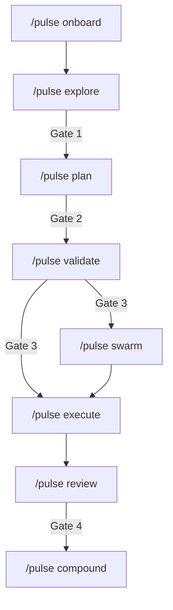

# Pulse Architecture

This document explains Pulse v2 as a single public router skill with a separate runtime CLI.

## In One Sentence

Pulse is a repo-local workflow system where `/pulse` defines user-facing flow, `pulse-work` manages canonical runtime metadata, and approval gates prevent unsafe execution.

## Mental Model

Pulse has four cooperating layers:

1. **Router contract**: `skills/pulse/SKILL.md` and `skills/pulse/commands/*`.
2. **Runtime control plane**: `.pulse/runtime/` for state, handoffs, and reservations.
3. **Workgraph plane**: `.pulse/workgraph/items.jsonl` plus derived views.
4. **Work content plane**: `works/` artifacts and verification evidence.

## Delivery Chain

## Responsibilities

| Command | Responsibility |
| --- | --- |
| `/pulse onboard` | Bootstrap runtime and readiness |
| `/pulse explore` | Lock decisions and context |
| `/pulse brainstorm` | Shape options before planning |
| `/pulse plan` | Select shape and current-work contract |
| `/pulse validate` | Prove feasibility/readiness |
| `/pulse swarm` | Coordinate parallel workers |
| `/pulse execute` | Implement approved work |
| `/pulse review` | Run quality gates and findings |
| `/pulse compound` | Capture reusable learnings |
| `/pulse rescue` | Recover from wrong-shape or stuck execution |
| `/pulse systematic-debug` | Root-cause-first debugging workflow |
| `/pulse note` / `note-distill` | Lightweight capture and synthesis |

## Runtime Boundaries

### User-facing routing

- `/pulse ...` is the only public workflow surface.
- Router behavior is declared in `skills/pulse/SKILL.md`.

### Runtime mutation surface

- `pulse-work ...` mutates workgraph metadata.
- Canonical metadata source: `.pulse/workgraph/items.jsonl`.

### State and scout

- Canonical runtime state: `.pulse/runtime/*`.
- Scout entrypoint: `node .pulse/scripts/pulse_status.mjs --json`.

## Canonical Planes and Key Files

| Path | Purpose |
| --- | --- |
| `.pulse/runtime/state.json` | machine-readable runtime mirror |
| `.pulse/runtime/STATE.md` | human-readable state narrative |
| `.pulse/runtime/handoffs/manifest.json` | pause/resume index |
| `.pulse/runtime/reservations.json` | active file reservations |
| `.pulse/workgraph/items.jsonl` | canonical work item metadata |
| `.pulse/workgraph/schema.json` | schema contract |
| `.pulse/workgraph/views/*.json` | derived views |
| `.pulse/harness/HARNESS_BACKLOG.md` | materialized backlog template |
| `works/` | content artifacts and verification docs |

## Coordination Model

- Use `pulse-work ready --json` to surface ready work.
- Use runtime reservations to prevent edit collisions in swarm mode.
- Keep `state.json` and `STATE.md` aligned during transitions.

## What Architecture Intentionally Excludes

This architecture defines `/pulse`, `pulse-work`, `.pulse/runtime`, and `.pulse/workgraph` as the active operational contract.
