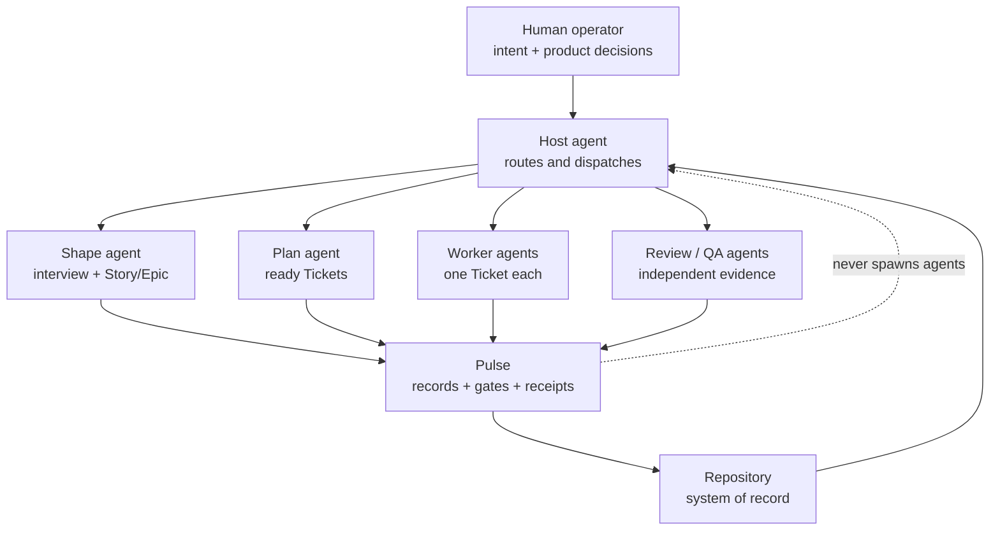
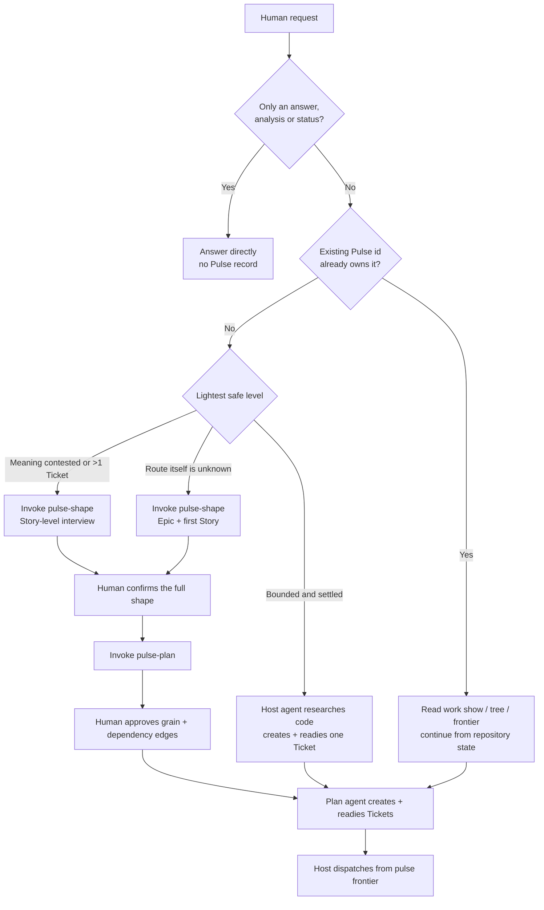
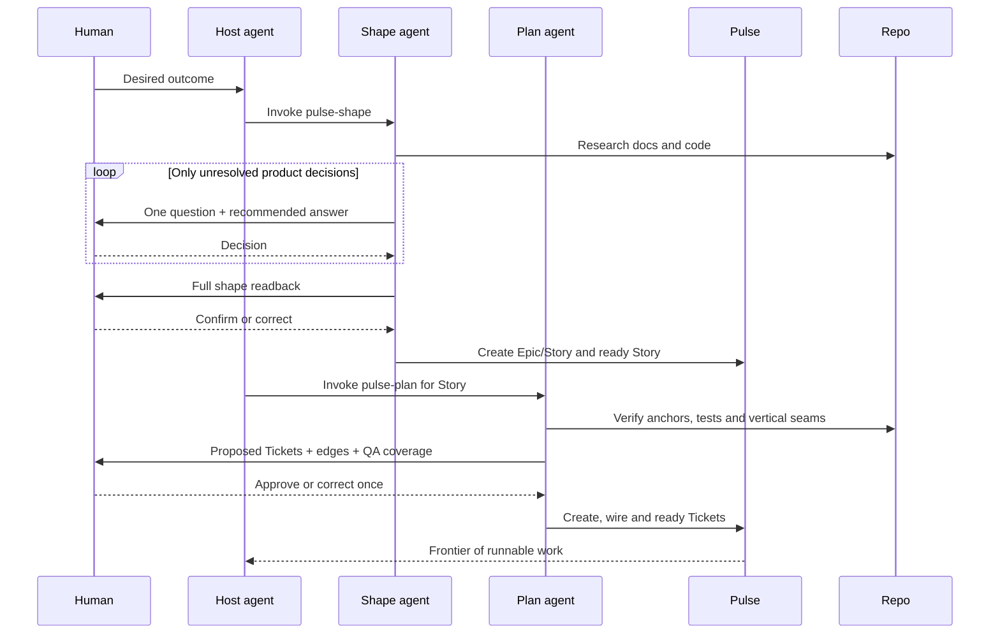
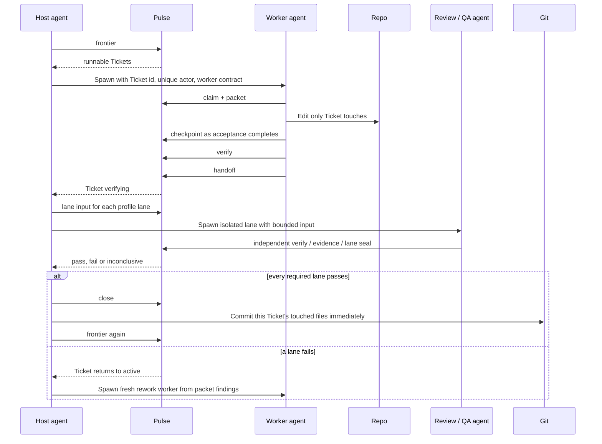
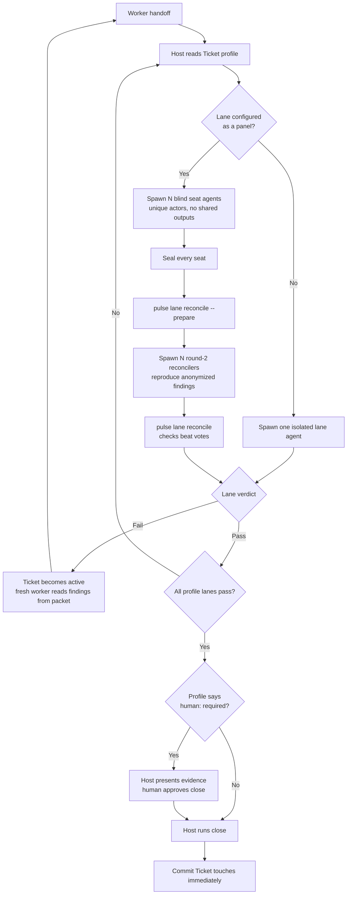

# Operating Pulse with coding agents

Pulse is not a project-management CLI that a human drives command by
command. It is the repository truth layer that a **host agent** drives while
humans provide intent and make product decisions.

The normal interaction is:

1. a human describes the outcome;
2. the host agent reads the repository contract and routes the request;
3. shaping and planning agents create the records when needed;
4. the host dispatches isolated worker, review and QA agents;
5. Pulse records claims, evidence and gate results;
6. the human is interrupted only for a real product decision, an explicit
   approval, or a profile that requires human authority.

> Except for installation and optional observability commands, commands in
> this guide describe what **agents** execute. They are not a checklist for
> the human.

The full command and error reference is [`SPEC.md`](../SPEC.md). This guide
explains how to operate the agent system built around it.

## 1. The operating model



| Role | Owns | Must not own |
|---|---|---|
| Human operator | Outcome, product decisions, approval of the Story shape and Ticket cut, required human gates | Typing lifecycle commands, composing Ticket payloads, running worker protocol |
| Host agent | Request routing, invoking skills, `frontier`, spawning sessions, lane orchestration, close and commit order | Implementing a Ticket or reviewing its own work |
| Shape agent | Repository research, one-question interview, Epic/Story records, product prose | Tickets or implementation |
| Plan agent | Reading the code, proposing the vertical cut, creating and readying Tickets after approval | Product decisions or implementation |
| Worker agent | One Ticket: claim, packet, edits, checkpoints, verify, handoff | Other Tickets, review, close, commit |
| Review / QA agent | One bounded lane input, independent checks, evidence and seal | Worker narrative, source edits, another seat's output |
| Pulse | Durable state, reservations, fences, receipts and gates | Dispatching an agent or deciding product intent |

The current conversation is normally the **host session**. Workers and lanes
are separate subagents or separate coding-agent sessions. Pulse itself has no
agent runtime and no daemon.

## 2. Install and bootstrap a repository

Prerequisites: Rust 1.78 or newer and git. From the **target repository**:

```bash
curl -fsSL "https://raw.githubusercontent.com/quanpersie2001/pulse/main/scripts/install-pulse.sh?$(date +%s)" |
  bash -s -- --yes
```

The bootstrap installs the `pulse` binary from `main`, verifies the binary's
reported version, runs `pulse init` (or `init --refresh` when already
enrolled), and installs the guidance skills for every detected host. The
target must be the root of an existing git worktree.

Useful installer options:

| Option | Use |
|---|---|
| `--directory <repo>` | Bootstrap a target other than the current directory |
| `--ref <tag-or-branch>` | Pin a release tag or select another Git ref |
| `--host <name>` | Install skills for one host; repeatable |
| `--with-qa-templates` | Add the shipped `qa-ui` / `qa-api` runners |
| `--binary-only` | Install the CLI without modifying a repository |
| `--dry-run` | Print Cargo/Pulse commands without writing anything |

From a local Pulse checkout (also the form used to test unreleased code):

```bash
scripts/install-pulse.sh --source . --directory <target-repository> --yes
```

Run the bootstrap against the target, never against the Pulse source checkout
unless Pulse itself is deliberately the target. `pulse init` creates the
store, `PULSE.md`, the Pulse block in `AGENTS.md`, and `.pulse/prompts/`; it
never silently overwrites repository-owned files. A repeat install uses the
three-way `init --refresh` path for managed contracts.

For a manual/non-installer setup, the equivalent is:

```bash
cargo install --path <pulse-checkout>
pulse --repo-root <target-repository> init
pulse --repo-root <target-repository> skills install --all-detected
```

Claude Code can make reservations binding at edit time:

```bash
pulse hook snippet claude
```

Paste the printed `PreToolUse` configuration into `.claude/settings.json`.
Pulse never edits host settings. Other hosts still have the handoff gate as
the second reservation net.

You can delegate bootstrap itself:

```text
Install and initialize Pulse in this repository with install-pulse.sh
(use --host <host>; add --with-qa-templates when this repo needs those
lanes). Show me any hook configuration I must paste manually. Then read the
new Pulse block in AGENTS.md, PULSE.md and .pulse/prompts/host.md. Do not
create work yet.
```

## 3. Start work with one host prompt

Do not ask the human to create a Ticket. Give the host agent the outcome and
let it choose the lightest safe path:

```text
Use Pulse to deliver this outcome:

<describe the user-visible or repository-visible result>

Act as the host, not as the worker. Read AGENTS.md, PULSE.md and
.pulse/prompts/host.md first. Classify the request as read-only, Ticket,
Story, or Epic + Story. Invoke pulse-shape and pulse-plan when their trigger
conditions apply; for a settled bounded change, create and ready the Ticket
yourself. I will answer product decisions and approve the proposed cut, but
I will not run Pulse lifecycle commands.

After planning, use pulse frontier, spawn one isolated worker per runnable
Ticket, then spawn every required review/QA lane as a different agent.
Continue through rework, close and per-Ticket commit. Stop only for a genuine
product decision, an explicit human-required gate, or a blocker the repo
cannot answer.
```

A shorter prompt is fine once the repository contract is established:

```text
Deliver <outcome> using the Pulse host workflow. Ask me only for product
decisions or required approval; derive repository facts yourself.
```

## 4. How the host routes a request



### Read-only work

An explanation, codebase question, diff review or status report creates no
record and takes no claim.

### Ticket-level work

A small, already-settled change skips shaping and planning. **The host agent**
reads the code, creates a complete Ticket, runs the ready gate and proceeds
to dispatch. The human still does not compose or type a Ticket command.

### Story or Epic work

The host invokes `.agents/skills/pulse-shape/`. The shape agent:

- researches repository facts instead of asking the human to guess;
- announces why the request is Story-level or Epic-level;
- asks exactly one product question per message, with a recommended answer;
- reads the whole outcome, rules, exceptions, boundaries and QA cases back;
- creates records only after the human confirms the complete shape.

The host then invokes `.agents/skills/pulse-plan/`. The plan agent reads the
actual code and existing tests, proposes vertical Tickets and dependency
edges in one message, and asks only whether the grain and edges are right.
After approval, the **agent** creates and readies every Ticket.



The shape and plan agents run mutation commands using the delegated
`human:<operator>` actor required by Pulse's authority matrix. The host uses
the same delegated authority for close commands. That is recorded authority,
not a requirement that the human type commands: the initial host instruction
may pre-authorize ordinary graph changes and closes, while a `human: required`
profile makes the host return for fresh, explicit approval.

## 5. Dispatch workers and lanes

After Tickets are ready, the host follows `.pulse/prompts/host.md` and never
implements the Ticket itself.



### Worker dispatch

Give the worker an id, a unique actor and the contract — not the whole host
conversation:

```text
You are agent:worker-2 for TK-<id>.
Read .pulse/prompts/worker.md and follow it exactly. Claim the Ticket, read
pulse packet as your only work input, implement only its touches, checkpoint,
run pulse verify, and hand off. Do not review, close or commit.
```

Every parallel worker needs a distinct actor (`agent:worker-1`,
`agent:worker-2`, …). The worker writes scratch payloads under
`.pulse/runtime/`, never at repository root, and asks `pulse reserve` before
editing a newly discovered path. If another Ticket holds that path, it
checkpoints and stops; it does not bypass the reservation.

### Lane dispatch

The target's `PULSE.md` selects lanes from `<surface>-<risk>`. The shipped
profiles include correctness review for all code, QA for UI/API medium-risk
work, adversarial review for high-risk work, and `human: required` for high
risk. The target may customize these profiles.

For every required lane, the host prepares bounded input and starts a fresh
agent:

```text
You are agent:review-correctness for TK-<id>.
Read .pulse/prompts/review-correctness.md. Your only task input is
<path printed by pulse lane input>. Keep source read-only, independently run
the declared verification, write the closed-schema evidence file, and seal
the lane. Do not read the worker's narrative or another lane's output.
```

A correctness reviewer that reports `pass` on a Ticket with `verify[]` must
run `pulse verify` as its own actor. Otherwise Pulse corrects the unsupported
pass to `inconclusive` at seal time.

Not every lane needs an LLM. With `--with-qa-templates`, the host runs the
repo-owned deterministic runner between the lane brackets:

```text
pulse lane input <id> qa-ui
node scripts/qa/ui.mjs <printed-input-path>
pulse lane seal <id> qa-ui --actor agent:qa-ui
```

`qa-api` is the same shape with `scripts/qa/api.mjs`; `check-docs` is produced
by `pulse docs check --ticket <id> --write <evidence-path>`. Pulse starts none
of these. A QA case without a mechanical `check` remains `inconclusive` — the
host must present the artifacts for independent human/reviewer judgment,
never invent a pass.

## 6. Panels, rework and close



Panel round 1 is blind: seats must not see each other's input or output.
Round 2 receives an anonymized finding list and asks each seat to reproduce,
refute or mark a duplicate. If a finding carries `check.argv`, Pulse runs the
check; the observed exit outranks every vote.

A failed lane sends the Ticket back to `active`. The host dispatches a fresh
worker; the new packet contains the last findings and checkpoint. The
reviewer never fixes its own finding.

A refused **seal** is different from a failed review: the same lane fixes only
the named schema/evidence problem and reseals against its existing snapshot
(up to the contract's three attempts). If the workspace moved, the host
prepares a fresh lane input and reruns the lane instead of pretending the old
observation still applies.

`done` is a gate result, not an agent's statement. After `pulse close`, the
host commits only that Ticket's files immediately so another Ticket's dirty
work cannot stale its fence.

## 7. Finish a Story and close the learning loop

A Story milestone is stricter than a Ticket close:

1. all child Tickets are `done` or deliberately cancelled;
2. each Ticket's files have been committed;
3. required Story-scope QA lanes run **after the final commit**, against the
   current HEAD;
4. every friction is classified;
5. product rules/exceptions are present in the Story's durable docs;
6. the whole tree is clean before `close-story`.

When a completed Ticket or cancelled work recorded friction, the host invokes
`.agents/skills/pulse-learn/` before attempting `close-story` (and again after
a Story close if that milestone recorded new friction). The learning agent
reads evidence, distills at most one general learning, chooses at most one
intervention (`check > template > doc > AGENTS`), and dismisses every
Ticket-specific friction with a reason.

Candidates do not silently become policy. After a later handoff records a
candidate as helpful, the host asks the human whether to activate it. An
active learning with `check_argv` runs automatically inside future
`pulse verify` calls.

An Epic closes only when its Stories are complete and every
`not_yet_specified` item has graduated into a shaped Story or moved to
`out_of_scope`.

## 8. When the human should be interrupted

| Moment | What the host should ask |
|---|---|
| Shape interview | One unresolved product decision, with a recommended answer |
| End of shaping | Confirm the complete outcome, rules, boundaries and QA cases |
| Ticket cut | Approve or correct Ticket grain and true dependency edges |
| High-risk close | Review the sealed evidence and authorize the human-required close |
| Non-mechanical QA evidence | Judge the screenshots/transcript or require a check; an agent must not invent `pass` |
| Scope contradiction | Decide whether newly discovered work belongs in or out |
| Learning activation/retirement | Confirm durable policy after evidence of usefulness or harm |
| External blocker | Provide authority or information absent from the repository |

Everything else is agent work. In particular, the host should not ask the
human to create a Ticket, copy a `run_id`, prepare a handoff payload, invoke a
review lane, or type `close`.

## 9. Observe and resume without becoming the worker

Humans may use the board, or ask the host to report from these read-only
surfaces:

```bash
pulse serve --open          # registered projects, board, evidence, events
pulse work tree             # durable work graph
pulse frontier              # what can run now
pulse doctor                # broken store, stale lease, unsealed lane
pulse events tail --follow  # append-only activity stream
```

A fresh host session does not need chat history:

```text
Resume this repository from Pulse state. Read AGENTS.md, PULSE.md and
.pulse/prompts/host.md. Inspect pulse work tree, pulse frontier and pulse
doctor. Continue the existing workflow; do not recreate records from this
chat and do not implement a Ticket in the host session.
```

If the coding environment has no subagent mechanism, open separate sessions
manually for the host, each worker and each lane. Give each session only its
role contract, Ticket id/actor and generated input path. The isolation rule
still applies even when a human opens the tabs.

## 10. Detect a broken orchestration

| Smell | Correct behavior |
|---|---|
| Host starts editing product code | Stop it; spawn a worker with `.pulse/prompts/worker.md` |
| Host asks the human to create or ready a Ticket | The host/shape/plan agent owns record creation after approval |
| Worker reviews or closes its own Ticket | Spawn an independent lane; host closes from receipts |
| Reviewer reads the worker summary | Regenerate/use `pulse lane input`; lanes judge the claim, not its narrative |
| Parallel workers share `agent:worker` | Give every worker a unique actor |
| Worker needs an unreserved file | `pulse reserve`; if held elsewhere, checkpoint and stop |
| Scratch JSON appears at repository root | Put it under `.pulse/runtime/` with the Ticket id |
| Closed Ticket remains uncommitted | Host commits its touched files before the next frontier pass |
| Story QA ran before the final commit | Re-run and reseal against current HEAD |
| Raw friction remains at Story close | Invoke `pulse-learn`; learn or dismiss with a reason |
| Agent reconstructs state from conversation | Read `work tree`, `packet`, receipts and events from the repo |

## 11. Contracts agents must read

| Artifact | Audience | Purpose |
|---|---|---|
| `AGENTS.md` Pulse block | Every host session | Routes read-only, Ticket, Story and Epic work |
| `PULSE.md` | Host, planner | Profiles, lanes, panels, human gates, fence policy |
| `.pulse/prompts/host.md` | Host only | Dispatch, panels, parallel Tickets, close order |
| `.pulse/prompts/worker.md` | One worker session | Claim → packet → checkpoint → verify → handoff |
| `.pulse/prompts/<lane>.md` | One lane session | Bounded input, evidence schema, sealing rules |
| `.pulse/prompts/reconcile.md` | Panel round-2 seat | Reproduce anonymized findings |
| `.agents/skills/pulse-shape/` | Shape agent | Product interview and Epic/Story creation |
| `.agents/skills/pulse-plan/` | Plan agent | Code-backed vertical Ticket cut |
| `.agents/skills/pulse-learn/` | Learning agent | Friction classification and one intervention |
| [`SPEC.md`](../SPEC.md) | Anyone debugging a gate | Exact lifecycle, gates, commands and errors |

The repository is the handoff. Sessions are disposable; Pulse state,
receipts, evidence, events and git history are not.
