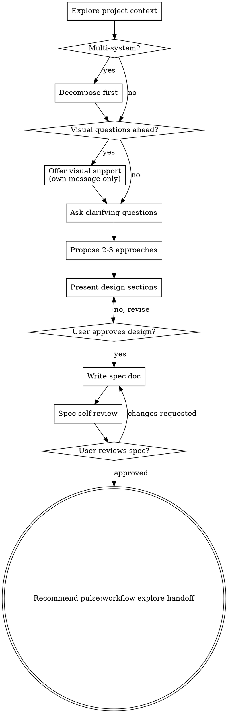

# `pulse:workflow brainstorm`

Turns vague intent into a documented, approved story-level design spec through structured dialogue before repo-grounded decision locking or implementation planning begins.

This command shapes exactly one story at a time. It does not brainstorm an epic-wide execution tree, and it does not write its output into the story `README.md`.

Validated designs reduce planning rework by stopping assumption drift before it compounds.

This command should behave like a disciplined design grilling session:
- walk the design tree until no planning-critical branch is unresolved
- ask the user only what the repo and docs cannot already answer
- when a strong default exists, include a recommended answer so the user can confirm or override it quickly

<HARD-GATE>
Do NOT invoke `pulse:workflow explore`, `pulse:workflow plan`, or any implementation command, write any code, create work items, or take implementation action until a design has been presented AND the user has approved it.
This applies regardless of perceived simplicity. The design can be short, but it MUST exist and be approved.
</HARD-GATE>

## Anti-pattern: "This is too simple to need a design"

Every new feature with unclear design goes through this process. A new config capability, a new function that expands behavior, a new UI path — if the shape is still fuzzy, this is where you turn it into an approved spec. "Simple" feature work is where unexamined assumptions cause the most wasted planning work. The spec can be a paragraph. But you MUST present it and get approval.

This is not the path for trivial non-feature corrections already covered by lighter execution posture. If the request is only a wording fix, local correction, or similarly bounded non-feature adjustment, follow the lighter route instead of forcing a brainstorming spec.

---

## Quick reference

| Step | What you do | What you produce |
|---|---|---|
| Explore context | Read just enough project material to understand what already exists | Internal context snapshot |
| Assess scope | Decide whether this is one feature or multiple independent systems | Scoped brainstorming target |
| Visual decision point | Decide whether upcoming questions are easier to answer by seeing options | User consent for visual support, or text-only path |
| Clarifying questions | Ask one question at a time to uncover purpose, constraints, and success criteria | Validated requirements |
| Approaches | Present 2–3 viable directions with trade-offs | Chosen direction |
| Design | Present the solution in sections and validate incrementally | Approved design |
| Spec | Write the approved design to `works/epics/<epic-id>-<epic-slug>/<story-id>-<story-slug>/SPEC.md` | Stable spec for exploration |
| Self-review | Run the spec reviewer and fix serious issues | Exploration-ready spec |
| User review gate | Wait for explicit approval on the written spec | Approved handoff artifact |
| Handoff | Update `.pulse/runtime/STATE.md` and recommend `pulse:workflow explore` as the next manual step | Clean pipeline transition |

---

## Checklist

Create a task for each item and complete them in order:

1. **Explore project context** — read files, docs, and recent commits relevant to the request
2. **Assess scope** — is this one feature or multiple independent systems?
3. **Offer visual support** — if upcoming questions would be easier to answer by seeing options, offer visuals in their own message
4. **Ask clarifying questions** — one at a time; purpose, constraints, and success criteria
5. **Propose 2–3 approaches** — with trade-offs and your recommendation
6. **Present design** — in sections scaled to complexity; get user approval after each section
7. **Write spec doc** — save the approved design to `works/epics/<epic-id>-<epic-slug>/<story-id>-<story-slug>/SPEC.md` and note the path
8. **Spec self-review** — independent check for placeholders, contradictions, scope, and ambiguity
9. **User reviews spec** — ask the user to confirm before proceeding
10. **Handoff to `pulse:workflow explore`** — recommend `pulse:workflow explore` as the next manual step to lock implementation decisions

---

## Process flow



**The terminal state is an approved design artifact under `works/` plus `.pulse/runtime/STATE.md` update, with a recommendation to run `pulse:workflow explore` next.** Do NOT invoke planning, validating, or any execution command by default. After brainstorming, the only valid next step is `pulse:workflow explore`.

---

## Phase 1: Explore context

Before asking any question, understand what already exists:

- Read `.pulse/project-docs.json` first when present, then read the listed project docs before relying on feature history alone.
- If `.pulse/project-docs.json` is absent, detect likely project docs such as `README.md`, architecture docs, ADRs, and domain docs, then read the smallest relevant set.
- Reuse existing glossary and terminology from project docs when present; do not invent new terms when established names already exist.
- Before asking, eliminate questions the repo can already answer. Read docs, code, and recent repo history first, then ask only for unresolved design intent.
- Check relevant files, docs, and the last few commits related to the topic.
- Identify existing patterns, components, or decisions that constrain the design.
- Note what can be reused versus what needs to be created from scratch.

Build an internal picture first. It makes clarifying questions concrete instead of generic.

---

## Phase 2: Scope assessment

Before asking detailed questions, assess whether the request is one feature or several.

**One feature** — scoped work with a clear boundary. Continue normally.

**Multiple independent systems** — for example, "build a platform with auth, billing, and analytics."
Flag this immediately:

> "This covers [A], [B], and [C] — three independent systems. Each needs its own brainstorming session. Let's start with [most foundational]. I'll note the others for later."

Then brainstorm the first subsystem through the full flow. Each subsystem gets its own spec → explore → plan → execute cycle.

### Step-back move — use selectively

Before detailed questioning, decide whether the request needs one brief step-back pass. This is not a new phase and not a replacement for sequential questioning. It is a short framing move to help ask better questions.

Use it only when one of these is true:
- the request names a solution but not the problem it should solve
- multiple feature shapes could satisfy the request
- the user is jumping quickly into screens, components, or flows before the core outcome is clear
- you notice yourself optimizing a local detail before the product goal is concrete

If you use the move, do it once, briefly, before Phase 3:
1. name the core outcome in plain language
2. name 2–4 decision axes that matter most
3. identify what should not be optimized yet
4. turn that framing into the next single question

Keep the output internal unless a short external framing statement will help the user align. Do not turn the step-back move into a mini-plan, a multi-question bundle, or an excuse to skip the structured question flow.

Example internal frame:
- Outcome: "Help a first-time user complete X confidently."
- Decision axes: primary user, success event, scope boundary, failure tolerance
- Not yet: exact layout, polish details, implementation mechanics

---

## Visual decision point

When upcoming questions involve layout, visual hierarchy, diagrams, flows, or side-by-side interface choices, offer visual support once before continuing.

Use this offer as its own message:

> "Some of this may be easier to evaluate if I show concrete options instead of only describing them in text. I can use inline previews or small mockups for the visual decision points. Want me to do that when it helps?"

<HARD-GATE>
This offer MUST be its own message. Do NOT combine it with a clarifying question, a context summary, or a recommendation. Ask, wait, then continue.
</HARD-GATE>

**How to decide:**

- **Use visuals** for layout comparisons, information hierarchy, diagrams, wireframes, and other questions where seeing options will reduce ambiguity.
- **Stay in text** for goals, scope, constraints, prioritization, trade-offs, and conceptual choices.
- A UI topic is not automatically visual. "Which outcome matters most?" is text. "Which dashboard layout is closer?" is visual.

**How to present visual choices:**

- Prefer `AskUserQuestion` with `preview` for side-by-side concrete artifacts.
- If the active harness offers another structured question tool instead of `AskUserQuestion`, use that tool rather than asking a plain-text visual question.
- Escalate to the local visual server only for genuinely complex visual ambiguity: styling direction, multi-screen flow shape, design-system composition, dense layout comparison, or hierarchy questions where a browser-rendered screen will clarify faster than previews.
- Start it with `scripts/start-visual-server.sh --project-dir <repo-root>`.
- If startup returns a `url`, tell the user the visual runtime is active, share the exact URL, tell them to open it in a browser, make their selection there, and return to the terminal after interacting.
- If startup returns an `error` or Node is unavailable, briefly tell the user the runtime could not be used, surface any useful retry hint, and continue with structured question-tool previews or text-only fallback if no question tool exists. Do NOT block the session on the runtime.
- After serving a visual screen, read `state_dir/events` on the next turn to pick up browser selections.
- Keep choices focused — 2–4 options max.
- Use single-select for competing directions; use multi-select only for independent add-on ideas.
- If a preview, mockup, or browser screen will not make the decision clearer, do not create one.

Accepting visual support does NOT turn the whole session visual. Decide per question whether text or visuals are the better fit.

---

## Phase 3: Clarifying questions

<HARD-GATE>
Ask ONE question at a time. Wait for the user's response before the next.
Do NOT batch questions. Do NOT answer your own questions.
If the active harness provides `AskUserQuestion`, `AskMeTool`, or another structured question tool, you MUST use it for every brainstorming question.
Do NOT ask a plain-text question while a structured question tool is available.
Only fall back to plain-text questions when no structured question tool exists in the current harness.
This gate is non-negotiable.
</HARD-GATE>

**Rules:**

- One question-tool invocation per turn — or one plain-text fallback question when no tool exists.
- Use structured question tools in this order when available: `AskUserQuestion` → `AskMeTool` → another equivalent harness-native question tool.
- Multiple-choice is preferred over open-ended when possible.
- Start broad — what, why, for whom — then narrow toward constraints, edge cases, and success criteria.
- For every question, include a clearly labeled recommended answer when a strong default exists.
- Keep walking the decision tree until each design-critical branch is chosen, rejected, delegated, or explicitly deferred.
- Do not stop after collecting preferences if a downstream planner would still need to guess.
- If the request is still shapeless after context review, use one brief step-back move before the next question so the question targets the real decision instead of a local detail.
- After 3–4 questions on one area, checkpoint with the structured question tool when available: "More questions about [area], or move on?"
- Do not mix plain-text questions and tool-based questions arbitrarily inside the same session.

**Question patterns:**

- **Product intent / constraints** → structured multiple-choice or short open-ended question via the harness question tool when available.
- **Competing layouts / hierarchy / flows** → offer visual support first, then use structured previews, mockups, or the advanced runtime when needed.
- **Trade-off choice** → keep it in text unless the trade-off is inherently visual, but still ask through the harness question tool when available.
- **Checkpointing** → after a few questions on one area, confirm whether to continue or advance with the harness question tool when available.

Examples:
- Text: "Which primary outcome should this optimize for first?"
- Visual: "Which of these three dashboard layouts is closer to the experience you want?"

**Scope creep** — when the user suggests something out of scope:

> "[Feature X] is a new capability — that's its own work item. I'll note it as a deferred idea. Back to [current topic]: [return to question]"

---

## Phase 4: Propose approaches

Present 2–3 different approaches before committing to one:

- Describe each option concisely with its trade-offs.
- Lead with your recommended option and explain why.
- Invite the user to push back or ask about specific trade-offs.

Do NOT start designing until the user picks a direction.

---

## Phase 5: Present design

Once the direction is clear, present the design:

- Scale each section to its complexity — a few sentences if simple, 200–300 words if nuanced.
- Ask "Does this look right so far?" after each section before moving to the next.
- Cover architecture, key components, data flow, error handling, and testing strategy.
- Be ready to revise. If something does not make sense, go back and clarify.

**Design for isolation:**

- Break the system into units, each with one clear purpose and well-defined interfaces.
- For each unit: what does it do, how do you use it, and what does it depend on?
- For new feature work, define module ownership from the start so each unit can evolve and optimize independently.
- A narrow first phase is acceptable only when the ownership model and final boundaries are already correct.
- Do not collapse multiple future concerns into one temporary implementation just to ship an MVP-shaped first version.
- Ask whether someone can understand a unit without reading its internals, and whether the internals can change without breaking consumers. If not, the boundaries need work.

**Working in existing codebases:**

- Follow existing patterns. Do not propose unrelated refactoring.
- Where existing code has problems that affect the work, include targeted improvements as part of the design.
- Stay focused on what serves the current goal.

---

## Phase 6: Write spec doc

After the user approves the design, write the spec.

**Path:** target story `SPEC.md` under `works/`, typically `works/epics/<epic-id>-<epic-slug>/<story-id>-<story-slug>/SPEC.md`

Rules:
- If the canonical story path is already known, write directly there.
- If the exact `works/` path is not yet known, confirm the target location with the user instead of inventing a legacy history mirror.
- Do not overwrite the story `README.md`; that file remains the durable story description, not the brainstorming output.
- The brainstorm artifact is a sibling file named `SPEC.md` inside the story directory.

The spec must include the story-level design needed for downstream exploration:
- problem statement and goals
- approved direction summary
- key components and behavior
- data or control-flow expectations when relevant
- error handling and fallback posture
- testing or verification intent
- explicit out-of-scope and deferred items

Do not write the spec before the user approves the direction.

---

## Phase 7: Spec self-review

After writing the spec, run an independent review using `spec-reviewer-prompt.md`.

Self-review must check for:
- TODOs, placeholders, or incomplete sections
- internal contradictions or conflicting requirements
- ambiguity serious enough to cause the wrong thing to be built
- scope that is too broad for a single feature cycle
- unrequested features or over-engineering

If serious issues are found:
- fix inline
- rerun the review
- stop after 2 repair loops and ask the user to review directly if serious issues remain

---

## Phase 8: User review gate

After the spec self-review passes:

> "Design spec written to `<works story SPEC.md path>`. Please review it and let me know if you want any changes before we start locking implementation decisions."

Wait for the user's response. If they request changes, make them, rerun the self-review loop when needed, and only proceed once the user approves.

---

## Phase 9: Handoff

After user spec approval:

1. Update `.pulse/runtime/STATE.md`:
   ```
   Current: brainstorming complete for <feature>
   Spec: <works story SPEC.md path>
   Next: invoke pulse:workflow explore to lock implementation decisions
   ```

2. Present to the user:
   > "Spec approved. Next step: run `pulse:workflow explore` to extract implementation decisions — gray areas, scope boundaries, and locked choices — before planning begins."

3. Optional continue-now path:
   - Only if the user explicitly asks to continue now, invoke `pulse:workflow explore` in the same session.
   - Otherwise stop after the spec approval, `.pulse/runtime/STATE.md` update, and recommendation above.

<HARD-GATE>
Do NOT invoke `pulse:workflow plan`, create work items, or write any code.
The terminal state of this command is a written, approved spec and state update.
The only valid next step is `pulse:workflow explore`.
</HARD-GATE>

---

## Key principles

- **One question at a time** — never overwhelm.
- **Multiple-choice preferred** — easier to answer than open-ended.
- **Question relentlessly, but only about decisions the repo cannot already answer.**
- **Use visuals only when they clarify** — seeing options should remove ambiguity, not add noise.
- **Honor existing glossary first** — prefer established project terminology and call out conflicts early.
- **YAGNI ruthlessly** — remove unrequested features from all designs.
- **Always propose alternatives** — 2–3 approaches before settling.
- **Incremental validation** — present design in sections, get approval before continuing.
- **Be ready to revise** — go back and clarify when something does not fit.
- **Do not scaffold project docs here** — brainstorming can consume existing docs, but durable project-doc scaffolding belongs to `pulse:workflow explore` when needed.

---

## What this command does NOT do

These are `pulse:workflow explore` responsibilities, not brainstorming responsibilities:

- deep codebase research, beyond the quick context pass here
- locking implementation decisions with stable IDs
- gray-area extraction against domain probes
- writing the downstream exploration context artifact
- creating work items

Brainstorming delivers a design spec. Exploration delivers locked decisions. Planning consumes both.

---

## Red flags

Stop immediately if you catch yourself doing any of these:

- writing code or pseudocode during the design phase
- asking two questions in the same message
- asking a plain-text question while `AskUserQuestion`, `AskMeTool`, or another structured question tool is available
- offering visual support and a clarifying question in the same message
- skipping the spec because the feature "seems obvious"
- answering a question you just asked
- treating every UI topic as visual instead of deciding per question
- invoking planning or execution before the spec is approved
- creating work items or referencing legacy bead IDs

---

## Anti-patterns

**"The user wants to move fast"**
Speed comes from clarity. A 10-minute design session prevents hours of planning rework caused by wrong assumptions downstream.

**"I already know what to build"**
Your assumptions are hypotheses until the user validates them.
Run the clarifying flow and let the user confirm the direction.

**"This is too small to document"**
The spec can be three sentences. But it MUST exist so `pulse:workflow explore` has a stable target.

**"This is a visual topic, so every question should be a mockup"**
No. Use visuals only when seeing options will remove ambiguity. Goals, priorities, and constraints still belong in text.

---

## References

- `spec-reviewer-prompt.md` — review prompt for spec document checking
- `visual-support-guidance.md` — when to use previews versus the advanced visual runtime during brainstorming
